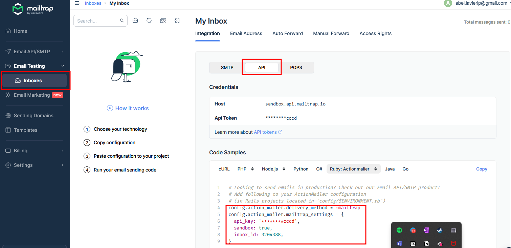
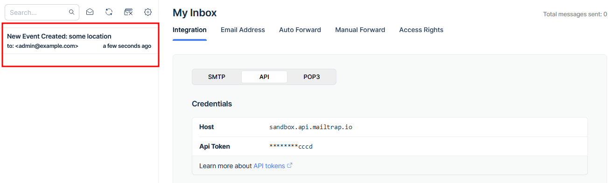

<a name="readme-top"></a>

<div align="center">
  <br/>
  <h1><b>PRD DataScheduler</b></h1><a name="about-project"></a>
</div>

# 📗 Table of Contents

- [📗 Table of Contents](#-table-of-contents)
- [📖🚗 PRD DataScheduler App ](#-prd-datascheduler-app-)
  - [🛠 Built With ](#-built-with-)
    - [Tech Stack ](#tech-stack-)
    - [Key Features ](#key-features-)
  - [💻 Getting Started ](#-getting-started-)
    - [Prerequisites](#prerequisites)
    - [Setup](#setup)
    - [Install](#install)
    - [Usage](#usage)
    - [Set up the mailer](#set-up-the-mailer)
    - [OpenWeather Integration and request:](#openweather-integration-and-request)
  - [👥 Developer ](#-developer-)
  - [🙏 Acknowledgments ](#-acknowledgments-)

# 📖🚗 PRD DataScheduler App <a name="about-project"></a>
This project is a take-home project for [DataScope](https://datascope.io/es/).
Click on the [link](https://github.com/alvp01/esports-gaming-center-backend) to navigate to the backend of our APP.
## 🛠 Built With <a name="built-with"></a>

### Tech Stack <a name="tech-stack"></a>

> List of technologies used for this project

<details>
  <summary>BackEnd</summary>
  <ul>
    <li><a href="https://rubyonrails.org">Ruby on Rails</a></li>
  </ul>
</details>

<details>
  <summary>Database</summary>
  <ul>
    <li><a href="https://www.postgresql.org/">PostgreSQL</a></li>
  </ul>
</details>

### Key Features <a name="key-features"></a>

- **List the users active event**
- **Mail the user when an event is created**
- **Notify the weather conditions if the event has a physical location**
- **Create events on users schedule**

<p align="right">(<a href="#readme-top">back to top</a>)</p>

## 💻 Getting Started <a name="getting-started"></a>

To get a local copy up and running, follow these steps.

### Prerequisites

In order to run this project you need:

you need to install ruby 3.3.5 using the prefer tool, example: 
- [rvm](https://rvm.io/)
- [rbenv](https://github.com/rbenv/rbenv)
- [asdf-vm](https://asdf-vm.com/)

- Browser (Google Chrome, Mozilla Firefox, Safari or any other browser)

### Setup

Clone this repository to your desired folder:


```sh
  cd my-folder
  git clone https://github.com/alvp01/datascope-scheduler.git
```

### Install

Install this project with:


```sh
  cd datascope-scheduler
  bundle install
```

### Usage

To run the project, execute the following command:

```sh
rails db:drop db:create db:migrate db:seed

rails s
```

The urls for the requests:

- Events:
  `GET http://127.0.0.1:3000/`: Lists all the events in chronological order
  `GET http://127.0.0.1:3000/api/v1/events`: Same as above
  `POST http://127.0.0.1:3000/api/v1/events`: Creates an event in a user's schedule
- User:
  `GET http://127.0.0.1:3000/api/v1/users`: Lists all the users and their events
  `GET http://127.0.0.1:3000/api/v1/users/:id`: List a user and their events
  `POST http://127.0.0.1:3000/api/v1/users`: Creates a user

Example bodies for post requests (using postman):

Event creation:
```
{
    "event": {
        "location": "some location",
        "start_time": "Saturday, October 12, 2024 at 04:35 AM",
        "end_time": "Saturday, October 12, 2024 at 04:40 AM"
    },
    "user_id": 7
}
```

User creation:
```
{
    "user": {
        "email": "example@email.com",
        "name": "some name"
    }
}
```

### Set up the mailer

- Create a .env files with the following keys:
MAILTRAP_TOKEN: you api token from mailtrap
INBOX_ID: it will tell the app where to send the mails
ADMIN_EMAIL: your email so it ways where is the email from and the destination email

- Create your [Mailtrap](https://mailtrap.io/) account
- You can find you MAILTRAP_TOKEN and INBOX_ID in the following section (click to copy):
  

- You can check the mailer worked by checking the Mailtrap inbox after creating an event:
  


### OpenWeather Integration and request:

Register at [OpenWeather](https://openweathermap.org/) and get your API key, then create a key in your .env file with the name: OPENWEATHER_API

To get the weather query, the request must be like the following:

```
{
    "event": {
        "location": "lat:45.133 lon:7.367",
        "start_time": "Saturday, October 12, 2024 at 06:05 AM",
        "end_time": "Saturday, October 12, 2024 at 06:20 AM",
        "is_physical_location": true
    },
    "user_id": 7
}
```

**note: if the is_physical_location key is false or doesn't exists the weather forecast will not appear. Additionally, is the is_physical_location key is given but wrong location is given (format or coordinates) the query will fail but the event will be created nonetheless** 

<p align="right">(<a href="#readme-top">back to top</a>)</p>


## 👥 Developer <a name="developer"></a>

👨🏼‍🚀 **Abel Lavieri** 🧙🏼‍♂️

- [GitHub](https://github.com/alvp01)
- [LinkedIn](https://www.linkedin.com/in/abel-lavieri)
  
<p align="right">(<a href="#readme-top">back to top</a>)</p>


## 🙏 Acknowledgments <a name="acknowledgements"></a>

We would like to thank Microverse for giving us the opportunity to learn and grow as developers and also We like to thank our family, they are all our support. 🌟

> Original design idea by [Murat Korkmaz on Behance.](https://www.behance.net/gallery/26425031/Vespa-Responsive-Redesign)

<p align="right">(<a href="#readme-top">back to top</a>)</p>

